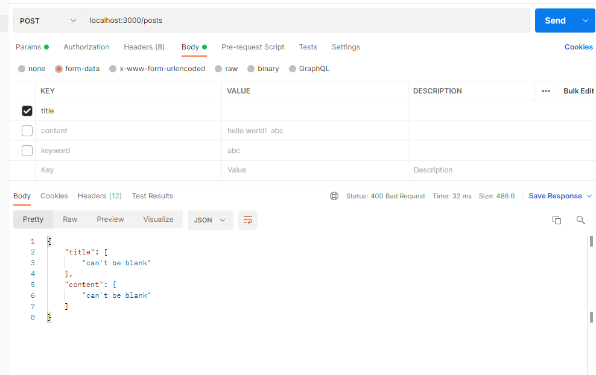

# 키워드 알림 API 개발

- **기술스택**: Ruby on Rails, Docker, sidekiq, redis
- 게시물 등록, 키워드 등록/삭제, 게시물 등록시 키워드 알림  API 구현
- RestFul API
- 키워드 알림 성능을 O(NM) -> O(NlogM)으로 개선
- 키워드 알림 비동기 병렬 처리(sidekiq 라이브러리 활용)
- 도커 테스트 환경 구축

## 키워드 매칭 비효율 문제와 해결책
- 게시물의 글자수가 N, DB에 저장된 키워드의 개수가 M개라고 할때
- 기존의 코드에서 알림이 필요한 키워드를 뽑는 시간 복잡도는 O(NM)입니다.
- 입력으로 들어온 게시물로부터 만들수 있는 길이 1부터 20까지(키워드의 글자수가 최대 20이라고 가정)의 부분 문자열을 모두 생성하면 등차수열의 합공식에 따라 대략 ((N+(N-19))+20)/2 => O(N)의 시간복잡도를 갖습니다. 각각의 부분 문자열이 DB에 존재하는 키워드 인지를 판단하기 위해 O(logM)시간복잡도가 요구됩니다. 키워드 필드로 인덱스를 생성하여야 logM이 될 수 있습니다. 따라서 최종적으로 O(NlogM)의 시간복잡도를 갖도록 개선할 수 있었습니다.
- N의 경우 최대 1100의 값을 갖게 되므로 큰 값을 갖을 수 있는 M으로 인해 발생하는 시간복잡도를 줄여 성능을 개선할 수 있었습니다.
- 추가로 뽑아낸 키워드마다 키워드 알림을 보내야하는 사용자를 선정하는 부분을 비동기 함수로 병렬 처리하여 속도를 개선하고자 했습니다.


# 실행 환경

- ruby 3.0.2
- rails Rails 6.1.4.1
- sidekiq
- redis

키워드 알림의 비동기 실행을 위하여 sidekiq 라이브러리를 사용했습니다. sidekiq 사용을 위하여 redis가 필요합니다.

# 실행 방법

도커 컴포즈를 이용하여 자동으로 환경을 구축하여 실행하도록 했습니다.

```
docker-compose up
```

# 테스트 결과

1. 게시글 등록
   
   

2. 키워드 등록
   
   

3. 키워드 삭제
   
   

4. 자동 알림 발송 기능
   
   
